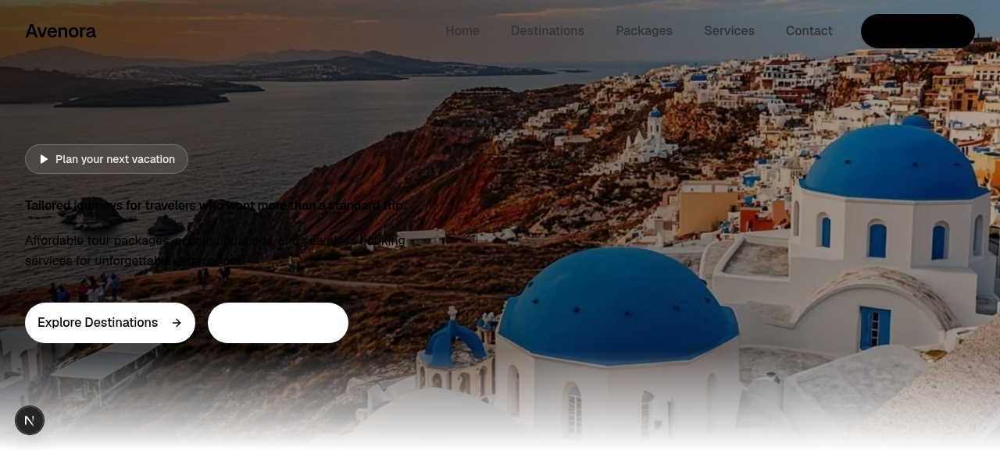
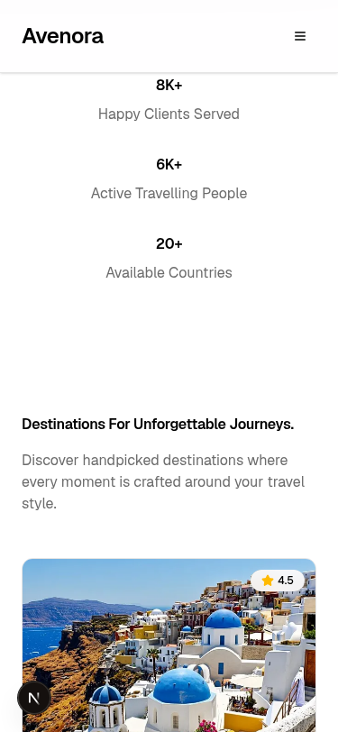
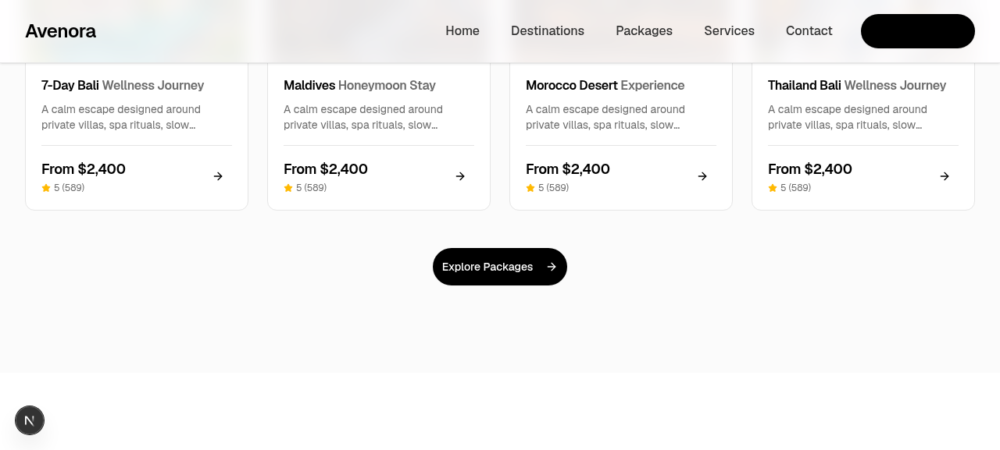
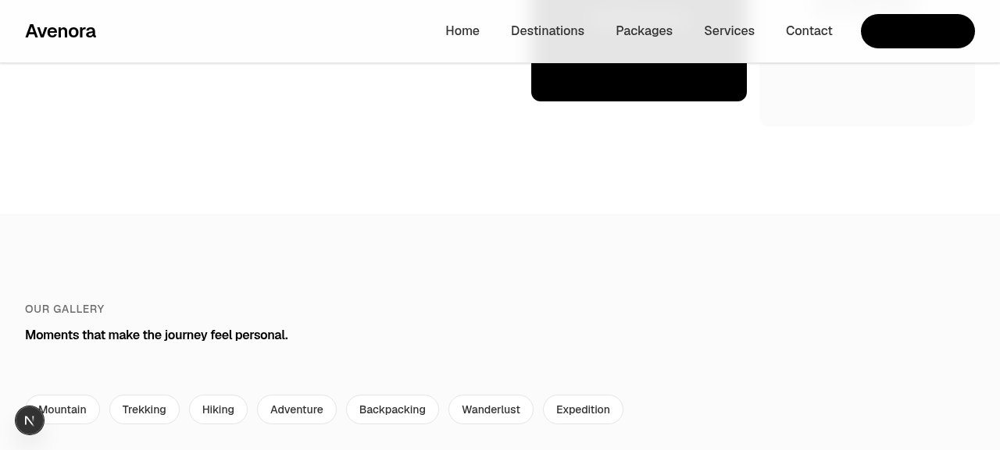

# Avenora

**Tailored journeys for discerning travelers.** Avenora is a polished, single-page marketing website for a luxury travel agency — built with Next.js 16, React 19, Tailwind CSS 4 and shadcn/ui. It ships a complete design system, 13 responsive sections, accessible interactive components and an optional Prisma + SQLite data layer.



---

## Table of contents

- [Overview](#overview)
- [Screenshots](#screenshots)
- [Tech stack](#tech-stack)
- [Project structure](#project-structure)
- [Getting started](#getting-started)
- [Environment variables](#environment-variables)
- [Available scripts](#available-scripts)
- [Sections & features](#sections--features)
- [Design system](#design-system)
- [Data layer (Prisma + SQLite)](#data-layer-prisma--sqlite)
- [Mini-services & deployment scripts](#mini-services--deployment-scripts)
- [Accessibility](#accessibility)
- [Linting & tooling](#linting--tooling)
- [Roadmap](#roadmap)
- [License](#license)

---

## Overview

Avenora recreates the [Avenora Webflow template](https://avenora.webflow.io/) as a production-shaped Next.js App Router project. The page is assembled from independent, self-contained section components, so blocks can be reordered, reused or swapped without touching the rest of the page.

**What you get out of the box**

- Fixed, scroll-aware navigation bar with a mobile sheet drawer.
- Full-viewport hero with layered gradient and dual calls-to-action.
- Animated counters, destination/package cards, service grid, masonry gallery, testimonial carousel, FAQ accordion and a validated contact form.
- A 48-component shadcn/ui library and a tokenised Tailwind v4 theme ready for extension.
- Standalone Next.js output (`next.config.ts` → `output: "standalone"`) plus shell scripts for dev, build and reverse-proxied production runs.
- An optional Prisma + SQLite scaffold (`User` / `Post`) wired through a `PrismaClient` singleton.

> The site is currently a **front-end marketing page**: the contact and newsletter forms simulate submission client-side, and the database layer is scaffolded but not yet consumed by a route.

---

## Screenshots

| Desktop | Mobile |
| --- | --- |
|  |  |

| Mid page | Packages & services |
| --- | --- |
|  |  |

---

## Tech stack

| Layer | Choice |
| --- | --- |
| Framework | [Next.js](https://nextjs.org/) `16.1.x` (App Router, standalone output) |
| UI library | React `19.2.x` |
| Language | TypeScript `5.9.x` |
| Styling | Tailwind CSS `4.1.x` + `@tailwindcss/postcss`, `tw-animate-css`, `tailwindcss-animate` |
| Components | shadcn/ui (new-york style, neutral base) on ~30 Radix UI primitives, `lucide-react` icons |
| Animations | CSS transitions + IntersectionObserver-driven counters (`framer-motion` available) |
| Forms & validation | `react-hook-form` + `@hookform/resolvers` + `zod` |
| Server state | TanStack Query `5.x` (available) |
| Client state | Zustand `5.x` (available) |
| Database | Prisma `6.19.x` + SQLite |
| Runtime / package manager | [Bun](https://bun.sh) (`bun.lock` committed) |
| Linting | ESLint `9.x` + `eslint-config-next` |
| Reverse proxy | Caddy (`Caddyfile`) |

> Several dependencies (`next-auth`, `next-intl`, `framer-motion`, `@tanstack/react-query`, `zustand`, `@dnd-kit`, `@mdxeditor`) are installed as a starter kit for future work — they are **not imported by the current page**, which keeps the shipped bundle lean.

---

## Project structure

```
Avenora/
├── public/
│   ├── images/                  # AI-generated travel photography (hero, destinations, gallery)
│   ├── logo.svg
│   └── robots.txt
├── src/
│   ├── app/
│   │   ├── layout.tsx           # Root layout, SEO metadata, <Toaster/>
│   │   ├── page.tsx             # Composes all 13 sections
│   │   ├── globals.css          # Tailwind v4 theme + Avenora design tokens
│   │   └── api/route.ts         # GET /api stub
│   ├── components/
│   │   ├── sections/            # 13 page sections (navbar → footer)
│   │   └── ui/                  # 48 shadcn/ui components
│   ├── hooks/                   # use-mobile, use-toast
│   └── lib/
│       ├── db.ts                # PrismaClient singleton
│       └── utils.ts             # cn() class helper
├── prisma/
│   └── schema.prisma            # User / Post models (SQLite)
├── db/
│   └── custom.db                # SQLite database file
├── mini-services/               # Drop-in sibling services (auto-detected by scripts)
├── examples/websocket/          # socket.io demo server + React client
├── .zscripts/                   # dev / build / start / mini-services shell scripts
├── Caddyfile                    # :81 reverse proxy → localhost:3000
├── next.config.ts
├── tailwind.config.ts
├── components.json              # shadcn/ui configuration
├── package.json
└── bun.lock
```

---

## Getting started

### Prerequisites

- **Bun ≥ 1.1** (recommended — the lockfile and scripts assume it). npm/pnpm/yarn also work for installing dependencies.
- Node.js 20+ if you prefer npm-based tooling.
- A POSIX shell (bash/zsh) for `.zscripts/*.sh`. On Windows, use WSL/Git Bash for those scripts; `bun run dev|build|lint` works in PowerShell too, though `build`/`start` use `cp`/`tee`.

### 1. Clone

```bash
git clone https://github.com/girishlade111/Avenora.git
cd Avenora
```

### 2. Install dependencies

```bash
bun install
```

`node_modules/` is git-ignored — dependencies are never committed.

### 3. Configure the environment

```bash
cp .env.example .env
```

`.env.example` ships a portable SQLite path (`file:./db/custom.db`). Adjust it if your database lives elsewhere.

### 4. Initialise the database

```bash
bun run db:generate   # generate the Prisma client
bun run db:push       # create/update the SQLite schema
```

A pre-seeded `db/custom.db` is included, so this step is optional on a fresh clone but required after changing `schema.prisma`.

### 5. Run

```bash
bun run dev
```

Open <http://localhost:3000>. Logs are tee'd to `dev.log`.

Or use the all-in-one script (install → db:push → dev server → health check → mini-services):

```bash
bash .zscripts/dev.sh
```

### Production build

```bash
bun run build   # next build + copy static/public into .next/standalone
bun run start   # serves the standalone server on :3000
```

Optionally front it with Caddy:

```bash
caddy run --config Caddyfile   # http://localhost:81 → localhost:3000
```

---

## Environment variables

| Variable | Required | Default | Description |
| --- | --- | --- | --- |
| `DATABASE_URL` | Yes (for Prisma) | `file:./db/custom.db` | Prisma / SQLite connection string. |

Create `.env` from `.env.example`. The `.env` file is listed in `.gitignore` (`.env*` with a `!.env.example` exception) and is **not** tracked by git — never commit real credentials.

Runtime code reads only `process.env.NODE_ENV` (`src/lib/db.ts`); additional variables introduced by `.zscripts` (`PORT`, `HOSTNAME`, `NEXT_TELEMETRY_DISABLED`) are set inside the scripts themselves.

---

## Available scripts

| Script | Command | Description |
| --- | --- | --- |
| `bun run dev` | `next dev -p 3000` | Start the dev server on port 3000 (logs to `dev.log`). |
| `bun run build` | `next build` + copy `static`/`public` into `standalone` | Production build with standalone output. |
| `bun run start` | `bun .next/standalone/server.js` | Run the production server (`NODE_ENV=production`). |
| `bun run lint` | `eslint .` | Lint the whole project. |
| `bun run db:generate` | `prisma generate` | Generate the Prisma client. |
| `bun run db:push` | `prisma db push` | Push the schema to SQLite (no migration files). |
| `bun run db:migrate` | `prisma migrate dev` | Create/apply a dev migration. |
| `bun run db:reset` | `prisma migrate reset` | Reset the database. |

---

## Sections & features

The page (`src/app/page.tsx`) renders these blocks in order:

| # | Section | File | Highlights |
| --- | --- | --- | --- |
| 1 | Navbar | `src/components/sections/navbar.tsx` | Fixed header, blur/white background after 20 px of scroll, desktop links, mobile Sheet drawer, CTA button |
| 2 | Hero | `src/components/sections/hero.tsx` | Full-screen `next/image` backdrop, gradient overlay, eyebrow pill, dual CTAs |
| 3 | Stats | `src/components/sections/stats.tsx` | `IntersectionObserver` + `requestAnimationFrame` eased counters (8K+ clients, 6K+ travellers, 20+ countries) |
| 4 | Destinations | `src/components/sections/destinations.tsx` | 4 destination cards with star ratings, responsive 1/2/4 grid |
| 5 | Packages | `src/components/sections/packages.tsx` | 4 packages with price, rating and review counts |
| 6 | Services | `src/components/sections/services.tsx` | Custom itineraries, honeymoon escapes, private tours, retreats |
| 7 | Experiences | `src/components/sections/experiences.tsx` | 6 image cards with label badges |
| 8 | Why choose us | `src/components/sections/why-choose-us.tsx` | Value props + decorative bento visual |
| 9 | Gallery | `src/components/sections/gallery.tsx` | 7 filter chips + masonry grid |
| 10 | Testimonials | `src/components/sections/testimonials.tsx` | 3-card carousel with prev/next controls and dot tabs (`role="tablist"`) |
| 11 | FAQ | `src/components/sections/faq.tsx` | 6-item single-open accordion (Radix Collapsible) |
| 12 | Contact CTA | `src/components/sections/contact-cta.tsx` | Form: name, email, trip type, budget, message — client-side validation + simulated submit/success state |
| 13 | Footer | `src/components/sections/footer.tsx` | Newsletter form, link columns, dynamic copyright year, mailto link |

**UI library:** `src/components/ui/` contains 48 shadcn/ui components — accordion, alert-dialog, avatar, badge, breadcrumb, button, calendar, card, carousel, chart, checkbox, collapsible, command, context-menu, dialog, drawer, dropdown-menu, form, hover-card, input, input-otp, label, menubar, navigation-menu, pagination, popover, progress, radio-group, resizable, scroll-area, select, separator, sheet, sidebar, skeleton, slider, sonner, switch, table, tabs, textarea, toast/toaster, toggle, toggle-group, tooltip and more.

**Routes:** `/` (marketing page) and `GET /api` (JSON stub returning `{ "message": "Hello, world!" }`).

---

## Design system

Tokens live in `src/app/globals.css` under Tailwind v4's `@theme inline`, so every utility (`bg-avenora-dark`, `rounded-avenora-pill`, `text-avenora-gray`, …) is generated on demand.

**Palette**

| Token | Hex | Use |
| --- | --- | --- |
| `--color-avenora-black` | `#000000` | Headings, primary buttons |
| `--color-avenora-white` | `#ffffff` | Surface |
| `--color-avenora-dark` | `#030505` | Dark sections, footer |
| `--color-avenora-gray` | `#333333` | Body copy |
| `--color-avenora-mid-gray` | `#6c6c6c` | Muted text |
| `--color-avenora-light` | `#fbfbfb` | Alternate surface |
| `--color-avenora-border` | `#e5e5e5` | Dividers, card borders |
| `--color-avenora-accent` | `#1a1a2e` | Accent / hover |

**Radii** `xs 12px → 2xl 32px`, plus `pill 999px`.
**Type scale** `xs 14px → 4xl 60px`.
**Spacing** `1 = 8px → 8 = 32px`.
**Motion** `--duration-instant: 400ms`.

Standard shadcn oklch variables (light/dark) are also defined; a dark-mode variant exists but no theme toggler is wired up yet.

---

## Data layer (Prisma + SQLite)

`prisma/schema.prisma`:

```prisma
model User {
  id        String   @id @default(cuid())
  email     String   @unique
  name      String?
  createdAt DateTime @default(now())
  updatedAt DateTime @updatedAt
}

model Post {
  id        String   @id @default(cuid())
  title     String
  content   String?
  published Boolean  @default(false)
  authorId  String
  createdAt DateTime @default(now())
  updatedAt DateTime @updatedAt
}
```

- Client singleton: `src/lib/db.ts` (avoids hot-reload connection reuse in development).
- Workflow is **push-based** — there is no `prisma/migrations/` folder yet; use `bun run db:push` for schema changes, or `bun run db:migrate` once you want versioned migrations.
- The schema and client are ready but not yet consumed by any route — see [Roadmap](#roadmap).

---

## Mini-services & deployment scripts

`mini-services/` is a convention folder for sibling Node/Bun services. Each service is a directory with a `package.json` (a `dev` script) and an entry `src/index.ts` / `index.ts`. The helper scripts auto-discover them:

| Script | Purpose |
| --- | --- |
| `.zscripts/dev.sh` | `bun install` → `db:push` → dev server with a curl health check → start every mini-service in dev mode |
| `.zscripts/build.sh` | Full build: install, `next build`, bundle mini-services, package `standalone` + `db` + `Caddyfile` into a `.tar.gz` |
| `.zscripts/start.sh` | Production launcher: standalone server → mini-services → Caddy in the foreground |
| `.zscripts/mini-services-install.sh` | `bun install` inside each `mini-services/*/` |
| `.zscripts/mini-services-build.sh` | Bundle each service with `bun build --target bun --minify` |
| `.zscripts/mini-services-start.sh` | Start every bundled `mini-services-dist/mini-service-*.js` |

`mini-services/` currently contains only `.gitkeep`, so the scripts no-op gracefully.

**Ports:** app `3000`, Caddy proxy `81`, websocket example `3003`.

---

## Accessibility

Built to **WCAG 2.2 AA**:

- Semantic `nav` / `section` / `article` / `footer` landmarks with `aria-label`s on every section.
- Visible `:focus-visible` rings on all interactive elements.
- Keyboard-operable accordion, testimonial carousel and mobile navigation drawer.
- Descriptive `alt` text on all imagery; decorative visuals are marked appropriately.
- Contrast-checked tokens for body text, muted text and borders.

---

## Linting & tooling

```bash
bun run lint      # ESLint 9 + eslint-config-next
```

- `eslint.config.mjs` — flat config extending `eslint-config-next/core-web-vitals` and `next/typescript`.
- `components.json` — shadcn/ui settings (`new-york`, neutral base, `@/components` aliases, lucide icons).
- `tsconfig.json` — `@/*` path alias, strict-ish defaults.
- `next.config.ts` — `output: "standalone"`, `images.qualities: [75, 90]`.

---

## Roadmap

- [ ] Wire the Prisma `User`/`Post` models into real API routes and replace the `/api` stub.
- [ ] Persist the contact form submission server-side (and add rate limiting).
- [ ] Add `next-intl` locale routes for a multilingual site.
- [ ] Add authentication with `next-auth`.
- [ ] Wire up a light/dark theme toggler.
- [ ] Add unit + E2E test suites (Vitest / Playwright).
- [ ] Add a `LICENSE` file and CI workflow (lint + build on PR).

---

## License

No license has been specified yet — all rights reserved by default. Feel open an issue or PR if you'd like to contribute.

---

<p align="center">
  <sub>Built with <a href="https://nextjs.org/">Next.js</a>, <a href="https://tailwindcss.com/">Tailwind CSS</a> and <a href="https://ui.shadcn.com/">shadcn/ui</a></sub>
</p>
